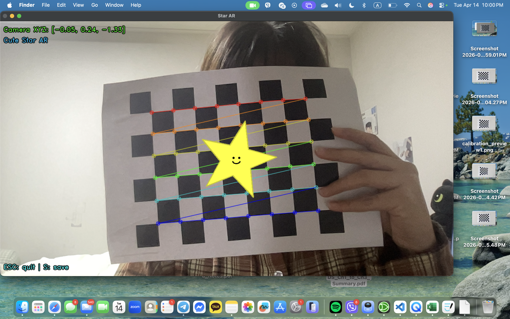
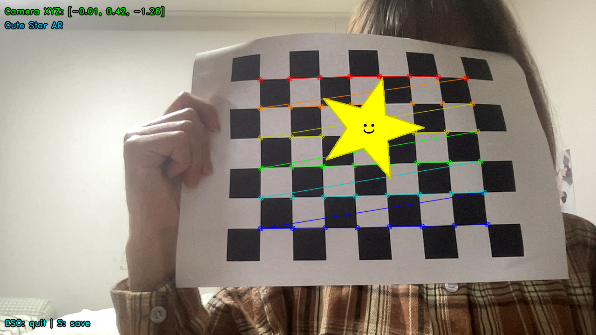
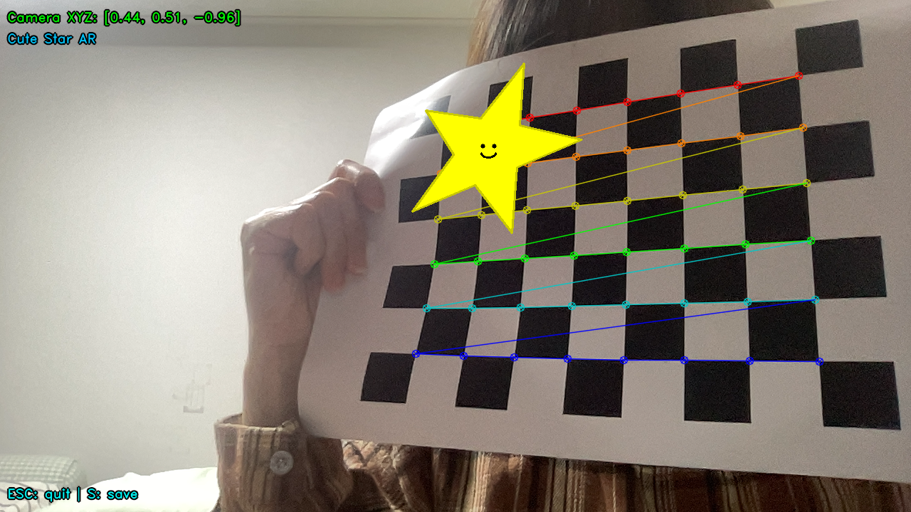
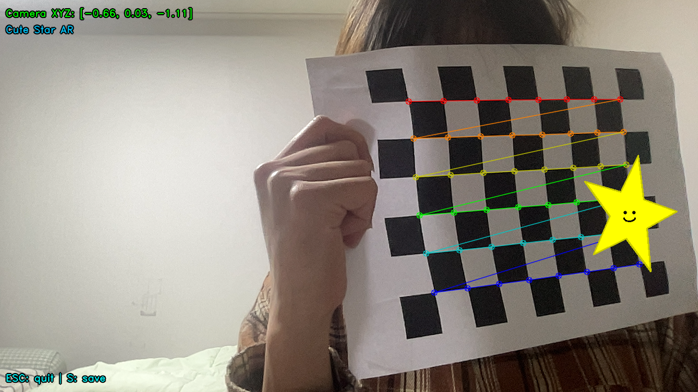

# star-ar-chessboard
OpenCV와 Python을 이용하여 체스보드 기반으로 카메라 자세를 추정하고, 영상 위에 귀여운 별 모양 AR 오브젝트를 표시하는 프로그램이다.

# 프로그램 설명
이 프로그램은 컴퓨터의 웹캠을 이용하여 실시간 영상을 보여주고,
체스보드 패턴을 검출하여 카메라의 자세(위치와 방향)를 추정한다.

이후 추정된 정보를 바탕으로 3차원 공간에 정의한 별 모양의 AR 오브젝트를
영상 위에 투영하여 표시한다.

또한 추가 기능으로 카메라 위치 정보를 화면에 출력할 수 있다.

# 주요 기능
- 웹캠 실시간 영상 표시
- 체스보드 코너 검출
- 카메라 자세 추정 (solvePnP)
- 별 모양 3D AR 오브젝트 표시
- 카메라 위치 정보 출력
- 스크린샷 저장 기능
- ESC 키로 프로그램 종료

# 사용 방법
1. Python과 OpenCV를 설치한다.
2. 프로그램을 실행한다.

# 키보드 조작 
| 키 | 기능 | 
|-------|-------| 
| S | 스크린샷 저장 | 
| ESC | 프로그램 종료 |

# 출력 파일
스크린샷은 assets 폴더 안에 demo1, demo2, etc 같은 파일로 저장된다.

# 추가 기능
별 모양 AR 오브젝트를 추가하였다.
체스보드가 인식되면 노란색 웃는 별이 화면 위에 나타나며, 카메라가 움직여도 별이 체스보드 위에 고정된 것처럼 보이도록 구현하였다.
또한 카메라의 위치 정보를 화면에 출력하여 현재 카메라의 좌표를 확인할 수 있다.

#실행 화면
아래는 프로그램 실행 화면이다. 체스보드가 인식되면 별 모양 AR 오브젝트가 표시된다.

Test

카메라를 움직이면 AR 오브젝트가 자연스럽게 따라 움직인다.

Demo1

Demo2

Demo3

